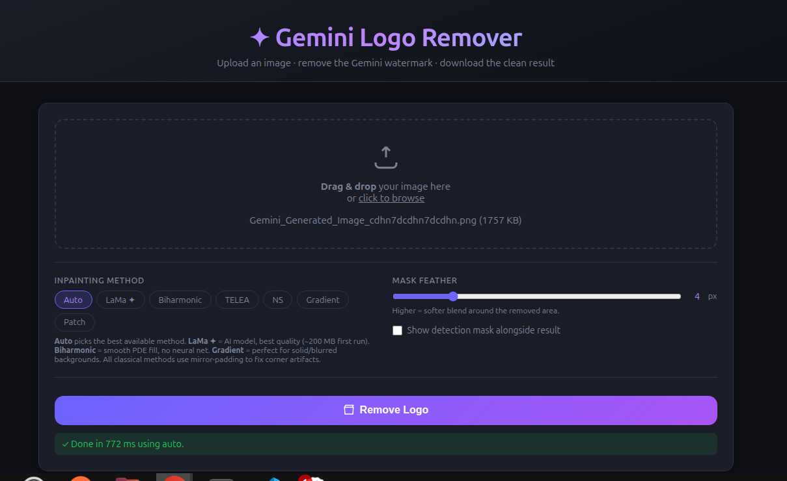

<div align="center">

# ✦ Gemini Logo Remover

### Remove the Gemini AI watermark from any image — instantly, for free, no cloud needed.


</div>

---

## What it does

When you generate images with Google Gemini, a sparkle logo **✦** appears in the bottom-right corner. This tool automatically detects and removes it — then fills the background so naturally that **no one can tell the logo was ever there.**

---

## Live Preview



> **Upload → Remove Logo → Download.** Done in under 1 second.

---

## Setup ( 3 commands, copy & paste )

```bash
git clone https://github.com/tanmoymondal1312/Gemini-Logo-Remover.git
cd Gemini-Logo-Remover
pip install -r requirements.txt
```

> **Requires Python 3.10+** — works on Windows, macOS, and Linux. No GPU needed.

---

## Run it

```bash
python server.py
```

Then open **http://localhost:8000** in your browser.

---

## How to use

### Web App — easiest

1. Run `python server.py`
2. Open **http://localhost:8000**
3. Drag your image onto the page
4. Click **Remove Logo**
5. Download the clean image

---

### Command Line

```bash
# Remove logo from one image
python cli.py photo.jpg

# Save to a specific file
python cli.py photo.jpg --output clean.jpg

# Process an entire folder
python cli.py ./my_images/ --batch --output ./cleaned/

# Also save the detection mask
python cli.py photo.jpg --save-mask
```

The cleaned image is saved as `photo_clean.jpg` automatically.

---

### Python code

```python
from core import remove_file

# Simplest usage
remove_file("photo.jpg", "clean.jpg")
```

```python
# With options
from core import remove_file

remove_file(
    "photo.jpg",
    "clean.jpg",
    method="auto",  # auto, gradient, biharmonic, telea, ns, lama
    feather=4       # edge softness: 0 = sharp, 20 = very soft
)
```

```python
# Works with image bytes too (for web apps / APIs)
from core import remove

with open("photo.jpg", "rb") as f:
    result = remove(f.read())

with open("clean.jpg", "wb") as f:
    f.write(result)
```

```python
# Works with OpenCV arrays
import cv2
from core import remove_array

img = cv2.imread("photo.jpg")
result, mask = remove_array(img)
cv2.imwrite("clean.jpg", result)
```

---

## Inpainting methods

The tool uses these methods to fill the area where the logo was.
**`auto` (default) always picks the best one for you.**

| Method | Quality | Speed | Best for |
|--------|:-------:|:-----:|----------|
| `auto` | Best available | — | Everything — just use this |
| `lama` | ⭐⭐⭐⭐⭐ | ~2s | Complex backgrounds, photos (needs extra install) |
| `biharmonic` | ⭐⭐⭐⭐ | ~1s | Smooth fill, works out of the box |
| `gradient` | ⭐⭐⭐⭐ | Fast | Solid colors, gradients, blurred backgrounds |
| `telea` | ⭐⭐⭐ | Fast | General use |
| `ns` | ⭐⭐⭐ | Fast | Smooth gradient backgrounds |
| `patch` | ⭐⭐ | Fast | Last-resort fallback |

### Want the absolute best quality? Install LaMa (optional):

```bash
pip install simple-lama-inpainting
```

Leave the method on `auto` — it will use LaMa automatically from that point on.
*(Downloads a ~200 MB model on first run. Cached after that.)*

---

## Project layout

```
Gemini-Logo-Remover/
│
├── core/
│   ├── detector.py     ← finds the Gemini logo in the image
│   ├── inpainter.py    ← fills the gap with realistic background
│   └── remover.py      ← ties detection + inpainting together
│
├── assets/
│   └── screenshot.png  ← UI preview (used in this README)
│
├── static/
│   └── index.html      ← the web page
│
├── server.py           ← start the web app
├── cli.py              ← command-line tool
├── requirements.txt    ← all dependencies (one pip command)
└── README.md
```

---

## Common questions

**The logo wasn't detected — what now?**
The tool has a built-in fallback that still covers the corner region. Try `--feather 8` for a larger blend zone.

**The background still looks a bit off?**
Switch to `--method gradient` (great for solid/gradient backgrounds) or install LaMa for the best possible result.

**Does this send my images to any server?**
No. Everything runs 100% on your machine. No internet connection needed after setup.

**Can I use this in my own project?**
Yes — MIT license. `from core import remove_file` and you're done.

---

## License

[MIT](LICENSE) — free to use, modify, and share.
