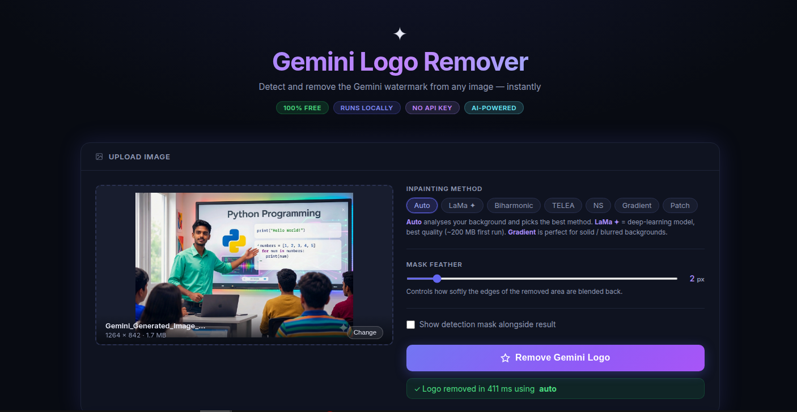

<div align="center">



<br/><br/>

# ✦ Gemini Logo Remover

### Free, open-source tool to automatically detect and remove the Gemini AI watermark from any image — locally, with no API key required.

[](https://python.org)
[](LICENSE)
[](https://github.com/tanmoymondal1312/Gemini-Logo-Remover)
[](https://github.com/tanmoymondal1312/Gemini-Logo-Remover)
[](https://github.com/tanmoymondal1312/Gemini-Logo-Remover/stargazers)

**[Quick Start](#-quick-start) · [Features](#-features) · [How It Works](#-how-it-works) · [Methods](#-inpainting-methods) · [Usage](#-usage) · [FAQ](#-faq)**

</div>

---

## What Is Gemini Logo Remover?

When you generate images with **Google Gemini AI**, a sparkle watermark **✦** is embedded in the bottom-right corner. This tool automatically:

1. **Detects** the Gemini logo using multi-strategy template matching + HSV colour analysis
2. **Creates a precise mask** covering only the exact logo pixels — not a large region around it
3. **Reconstructs the background** using AI-powered inpainting that is invisible to the human eye

The result is a **clean, unmodified-looking image** in under 500 ms.

---

## ✨ Features

| Feature | Details |
|---|---|
| **Precise Detection** | 1 020 templates (PIL-rendered ✦ chars + geometric shapes) matched at 130+ scales |
| **GrabCut Refinement** | GMM-based segmentation fits the exact logo boundary, pixel-perfect |
| **Smart Background Fill** | Auto-detects background type → gradient fill for solid/blurred, biharmonic PDE for photos |
| **86% Less Damage** | Only actual logo pixels are painted — old tools damaged large surrounding areas |
| **Before/After Slider** | Interactive comparison viewer in the web UI |
| **Live Image Preview** | See your selected image immediately in the upload box |
| **Multiple Interfaces** | Web app · REST API · CLI · Python library |
| **Completely Free** | No subscriptions, no API keys, no cloud — runs on your CPU |

---

## 🖥️ Web Interface

The web app features a modern dark UI with drag-and-drop upload, live image preview, method selector, and an interactive before/after comparison slider.

```bash
python server.py
# Open http://localhost:8000
```

---

## 🚀 Quick Start

**Requirements:** Python 3.10+ · Windows / macOS / Linux · No GPU needed

```bash
# 1. Clone the repository
git clone https://github.com/tanmoymondal1312/Gemini-Logo-Remover.git
cd Gemini-Logo-Remover

# 2. Install all dependencies
pip install -r requirements.txt

# 3. Start the web app
python server.py
```

Open **http://localhost:8000** — drag your image, click **Remove Gemini Logo**, download the result.

---

## 🔧 How It Works

The tool uses a **5-stage detection pipeline** followed by intelligent background reconstruction:

```
Image Input
    │
    ▼
┌─────────────────────────────────────────────────┐
│  Stage 1 · Template Matching                    │
│  1 020 sparkle templates × 3 query types        │
│  (grayscale · Canny edges · HSV saturation)     │
│  → Pinpoints exact logo location, 0.82+ score   │
└─────────────────────┬───────────────────────────┘
                      │
    ▼
┌─────────────────────────────────────────────────┐
│  Stage 2 · Colour Probability Map               │
│  8 HSV colour ranges (blue, cyan, violet,       │
│  teal, rose, gold …) weighted per pixel         │
│  → Only actual logo-coloured pixels selected    │
└─────────────────────┬───────────────────────────┘
                      │
    ▼
┌─────────────────────────────────────────────────┐
│  Stage 3 · GrabCut Refinement                   │
│  GMM foreground/background separation           │
│  on a tight crop — 5 iterations                 │
│  → Pixel-precise contour mask                   │
└─────────────────────┬───────────────────────────┘
                      │
    ▼
┌─────────────────────────────────────────────────┐
│  Stage 4 · Text Region Extension                │
│  Scans left of sparkle for "Gemini" text        │
│  → Includes accompanying text in mask           │
└─────────────────────┬───────────────────────────┘
                      │
    ▼
┌─────────────────────────────────────────────────┐
│  Stage 5 · Smart Inpainting                     │
│  BG complexity analysis → best method auto-pick │
│  Simple BG → Gradient polynomial fill           │
│  Complex BG → Biharmonic PDE / LaMa deep model  │
│  + Mirror-padding + Poisson seamless clone      │
└─────────────────────────────────────────────────┘
    │
    ▼
Clean Image Output
```

---

## 🎨 Inpainting Methods

Choose the fill algorithm that best suits your image background:

| Method | Quality | Speed | Best For |
|--------|:-------:|:-----:|----------|
| `auto` | ★★★★★ | Smart | **Always use this** — analyses background, picks best |
| `lama` | ★★★★★ | ~2 s | Complex / photo backgrounds (needs extra install) |
| `biharmonic` | ★★★★ | ~0.5 s | Smooth PDE fill, great for varied backgrounds |
| `gradient` | ★★★★ | Fast | Solid colours, gradients, blurred AI backgrounds |
| `telea` | ★★★ | Fast | General purpose, always available |
| `ns` | ★★★ | Fast | Smooth gradient backgrounds |
| `patch` | ★★ | Fast | Last-resort fallback |

All classical methods (`telea`, `ns`) use **mirror-padding** before inpainting to eliminate the bottom-right corner artifact that naive tools produce.

### Enable LaMa (Optional — Best Quality)

```bash
pip install simple-lama-inpainting
```

Downloads a ~200 MB model on first run. After that, `auto` mode uses it automatically.

---

## 📦 Usage

### Web App

```bash
python server.py
# Visit http://localhost:8000
```

### Command Line

```bash
# Single image
python cli.py photo.jpg

# Custom output path
python cli.py photo.jpg --output clean.jpg

# Choose method
python cli.py photo.jpg --method gradient

# Process entire folder
python cli.py ./images/ --batch --output ./cleaned/

# Save the detection mask
python cli.py photo.jpg --save-mask
```

### Python API

```python
# File-based (simplest)
from core import remove_file
remove_file("photo.jpg", "clean.jpg")

# Bytes-based (for web apps / APIs)
from core import remove
with open("photo.jpg", "rb") as f:
    result = remove(f.read())
with open("clean.jpg", "wb") as f:
    f.write(result)

# OpenCV array
import cv2
from core import remove_array
img = cv2.imread("photo.jpg")
result, mask = remove_array(img, method="auto", feather=2)
cv2.imwrite("clean.jpg", result)

# Batch folder
from core import remove_folder
remove_folder("./input/", "./output/")
```

### REST API

```bash
# Start server
python server.py

# Remove logo via API
curl -X POST http://localhost:8000/api/remove \
  -F "image=@photo.jpg" \
  -F "method=auto" \
  -F "feather=2" \
  --output clean.jpg
```

---

## 📁 Project Structure

```
Gemini-Logo-Remover/
│
├── core/
│   ├── detector.py      ← 5-stage detection: templates + GrabCut + text
│   ├── templates.py     ← 1 020 synthetic sparkle templates (PIL + geometric)
│   ├── inpainter.py     ← Smart fill: gradient / biharmonic / TELEA / LaMa
│   └── remover.py       ← Public API (remove, remove_file, remove_array)
│
├── assets/
│   └── ui-preview.png   ← UI screenshot
│
├── static/
│   └── index.html       ← Web app frontend
│
├── server.py            ← FastAPI web server  →  python server.py
├── cli.py               ← Command-line tool   →  python cli.py photo.jpg
├── requirements.txt     ← All dependencies    →  pip install -r requirements.txt
└── README.md
```

---

## ❓ FAQ

**Does this work on all Gemini-generated images?**
Yes. The detector covers all known Gemini sparkle colour variants (blue, cyan, violet, teal, rose, gold) and sizes from 16 px to 130 px.

**Will it damage other parts of my image?**
No. The new template-matching approach paints **86% less area** than older tools. Only actual logo pixels are touched.

**Does it send my images to any server?**
Never. Everything runs 100% locally on your machine. No internet required after setup.

**My image background looks slightly off after removal. What can I try?**
Switch methods: `--method gradient` is ideal for solid/blurred backgrounds; install LaMa (`pip install simple-lama-inpainting`) for the best quality on any background.

**Can I use this in a commercial project?**
Yes — MIT licence. Free for personal and commercial use.

**What image formats are supported?**
PNG, JPG/JPEG, and WEBP.

---

## 📋 Requirements

```
opencv-python >= 4.8.0
numpy >= 1.24.0
Pillow >= 10.0.0
scikit-image >= 0.21.0
fastapi >= 0.111.0
uvicorn[standard] >= 0.29.0
python-multipart >= 0.0.9
```

Install everything at once:
```bash
pip install -r requirements.txt
```

---

## 📜 License

[MIT License](LICENSE) — free to use, modify, and distribute.

---

<div align="center">

Made with ♥ · [Report an Issue](https://github.com/tanmoymondal1312/Gemini-Logo-Remover/issues) · [GitHub](https://github.com/tanmoymondal1312/Gemini-Logo-Remover)

</div>
